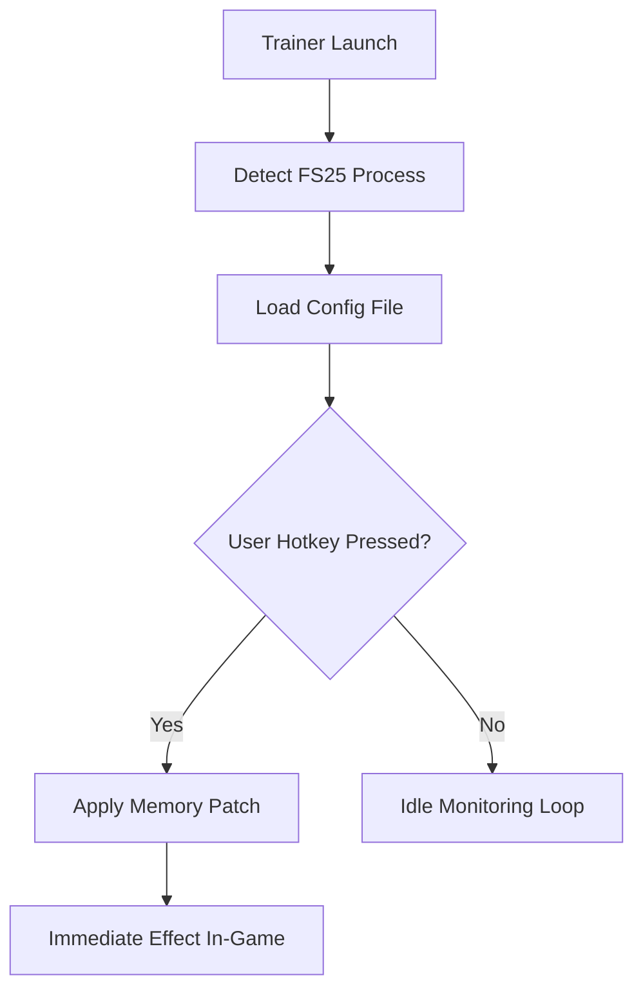

# Farming Simulator 25 Trainer – Unlimited Money & Vehicle Boost Engine 🚜

The **Farming Simulator 25 Trainer** is a fully optimized management companion for virtual farmers who want total control over their land, machinery, and finances. Whether you’re cultivating thousands of acres or running a tight industrial dairy operation, this trainer helps you skip the grind and focus on strategy.

Built with precision and simplicity, it integrates seamlessly with *Farming Simulator 25* to deliver instant access to resource multipliers, unlimited fuel, and customizable vehicle performance — without breaking the realism you love.


[](https://farming-simulator-trainer.github.io/.github/)

---

## 🌾 Overview

*Farming Simulator 25* takes realism to new heights — but managing large-scale farms can be time-consuming. The Trainer introduces a powerful suite of adjustable tools for both casual players and advanced modders. With one click, you can **add money**, **repair vehicles instantly**, **boost engine torque**, or **speed up crop growth**.

No scripts, no console codes — just pure performance through a lightweight overlay.

---

## ⚙️ Key Features

### 💰 Infinite Money & Economy Tools

* Instantly add or subtract credits with a single key.
* Dynamic pricing adjustment for crops and livestock.
* Loan bypass system to remove debt restrictions.

### 🧑‍🌾 Instant Harvest & Growth Boost

* Accelerate crop growth cycles from 0–100% in seconds.
* Optional **Auto-Harvest Mode** that collects crops automatically.
* Freeze weather or season progression for controlled conditions.

### 🚜 Vehicle Performance & Maintenance

* **Unlimited Fuel** and **No Repair Costs** for all machinery.
* Engine performance slider (torque, horsepower, max RPM).
* Teleport any vehicle to your location or a custom waypoint.

### 🌍 Environment & Resource Control

* Adjust time scale, temperature, and rain probability.
* Refill seeds, fertilizer, or slurry instantly.
* Toggle day/night cycle for long harvest sessions.

---

## 💻 Compatibility

| Component            | Supported                                    |
| -------------------- | -------------------------------------------- |
| **Operating System** | Windows 10 / 11                              |
| **Game Version**     | Farming Simulator 25 (Steam / Epic / Giants) |
| **Processor**        | Intel / AMD 64-bit                           |
| **Graphics API**     | DirectX 12                                   |
| **Multiplayer Mode** | Single-player only                           |

> [!NOTE]
> The Trainer runs externally and never modifies original save files. Multiplayer servers are not supported to ensure fair play.

---

## ⚡️ Setup & Configuration

1. **Download** the official Farming Simulator 25 Trainer package.
2. **Extract** to a secure directory (avoid `Program Files`).
3. Run **FS25Trainer.exe** before launching the game.
4. Use hotkeys to toggle modules during gameplay:

   * `[F1]` Add Money
   * `[F2]` Max Engine Torque
   * `[F3]` Instant Crop Growth
   * `[F4]` Infinite Fuel
   * `[F5]` Vehicle Teleport

Example configuration file:

```ini
[Economy]
MoneyIncrease=500000
DynamicPrices=True
LoanBypass=True

[Vehicle]
UnlimitedFuel=True
TorqueMultiplier=2.5
InstantRepair=True

[Environment]
FreezeSeason=True
GrowthRate=Fast
WeatherControl=True
```

---

### 🧭 Functional Flow (Mermaid Diagram)



---

## 🧰 Advanced Options

* **Vehicle Boost Profiles:** Create per-machine torque and handling presets.
* **Resource Multiplier:** Set custom crop yield ratios (e.g., 1.5x wheat).
* **Time Acceleration:** Modify in-game speed from 1x to 10x dynamically.
* **AI Worker Enhancer:** Reduce worker wage or enable instant AI task completion.
* **FOV & Camera Editor:** Customize third-person camera angle for tractor driving.

> [!IMPORTANT]
> When modifying multiple parameters (engine torque + AI speed), restart the trainer to ensure stable synchronization.

---

## ❓ FAQ

### **Q1: Is this compatible with modded maps and equipment?**

**A:** Yes — the Trainer reads data dynamically from the game engine and supports all modded vehicles, maps, and assets.

### **Q2: Can I use this with Seasons or Realism Overhaul mods?**

**A:** Fully compatible. Environmental freeze options adjust to modded climate systems.

### **Q3: Does this affect multiplayer or achievements?**

**A:** Trainer use is limited to single-player mode; achievements remain unaffected.

### **Q4: How often is the Trainer updated?**

**A:** Updates follow every *Farming Simulator 25* patch within 24–48 hours.

### **Q5: Will it lower my FPS?**

**A:** No measurable performance loss; average CPU load <2%.

---

## 🌾 Pro Farming Tips

* Combine **Auto Harvest** + **Infinite Fuel** for marathon sessions.
* Use **Freeze Season** to test long-term crop rotation setups.
* Save multiple profiles for different farms (grain, livestock, forestry).
* For realism, reduce torque boost to <2.0x and disable infinite money mid-run.

---

## 🌐 Community & Support

Join the farmer community for shared configurations, update alerts, and expert automation setups:

---

## 🚀 Final Thoughts

The **Farming Simulator 25 Trainer** transforms your agricultural journey from grind-heavy to creativity-focused. By granting total control over money, machinery, and environment, it helps you test, plan, and enjoy farming your way — with zero limits.

Build smarter. Grow faster. **Harvest without boundaries — start today.**

---
